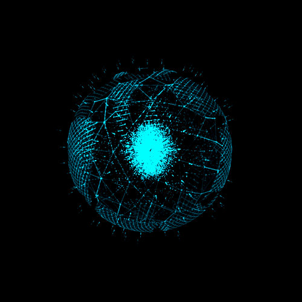

  

---

  

---

Estudante de <strong>Análise e Desenvolvimento de Sistemas</strong> na Faculdade de Tecnologia Prof. José Camargo – Jales/SP.  
Apaixonado por tecnologia e desenvolvimento de software, sempre em busca de novos desafios e evolução constante.  
Aqui você encontrará meus projetos, estudos e experiências no mundo da programação.

---

<h3 align="center">Connect with me</h3>

---

<h3 align="center">My Stack</h3>

---

<h3 align="center">GitHub Stats</h3>

---
## 📊 GitHub Stats

---

---

<picture>
  <source media="(prefers-color-scheme: dark)" srcset="https://raw.githubusercontent.com/EduaBta/EduaBta/output/github-contribution-grid-snake-dark.svg">
  <source media="(prefers-color-scheme: light)" srcset="https://raw.githubusercontent.com/EduaBta/EduaBta/output/github-contribution-grid-snake.svg">
  
</picture>
