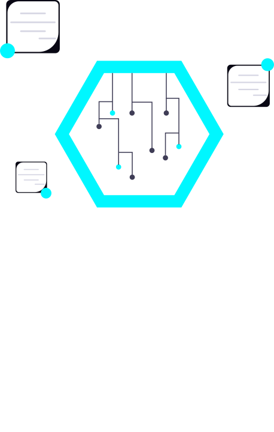

  

  

  
  

### 👨‍💻 Sobre mim

- 🎓 Estudante de **Análise e Desenvolvimento de Sistemas** na **Fatec Prof. José Camargo – Jales/SP**
- 💻 Desenvolvedor **Full Stack**, apaixonado por tecnologia e desenvolvimento de software
- 🔭 Construindo meu novo **portfólio** com **React, Vite e GSAP**
- 🌱 Sempre em busca de novos desafios e evolução constante
- 📂 Aqui você encontra meus projetos, estudos e experiências no mundo da programação

 

<h3 align="center">🤝 Conecte-se comigo</h3>

  
  
  
  
  

<h3 align="center">🛠️ Tecnologias</h3>

  

<h3 align="center">📊 GitHub Stats</h3>

  
  

  

  <picture>
    <source media="(prefers-color-scheme: dark)" srcset="https://raw.githubusercontent.com/EduaBta/EduaBta/output/github-contribution-grid-snake-dark.svg" />
    <source media="(prefers-color-scheme: light)" srcset="https://raw.githubusercontent.com/EduaBta/EduaBta/output/github-contribution-grid-snake.svg" />
    
  </picture>

